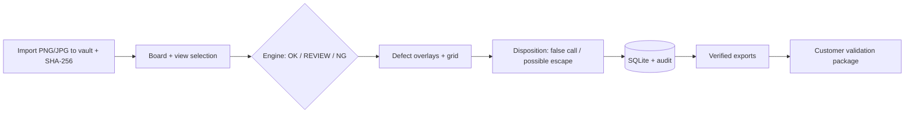
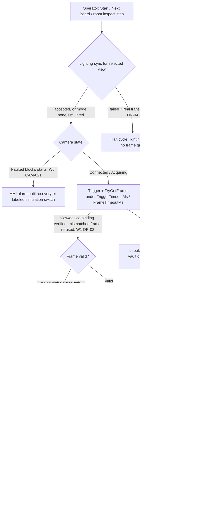
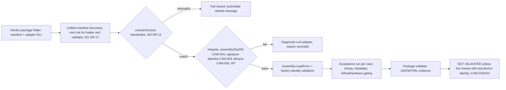

OpenAI/Codex and numerous other coding agents will review your output once you are done.

# AOI Monitor Architecture

Architecture reference for AOI Monitor: read before changing layer/service boundaries, replacing a simulated camera/lighting/3D/robot/MES/central-sync seam, or building a vendor adapter package. The canonical module/requirement catalogue is the engineering standard (`Docs/standard/00_Index.md`, VOL03); schema and data flow: `Docs/DATA_PIPELINE.md`.

**한국어 요약.** 카메라 없이 저장된 PCB 사진만으로 AOI(자동 광학 검사) 흐름 전체를 검증하는 1단계 Windows 데스크톱 프로그램(.NET 10, WPF)이며, 카메라·로봇·MES 연동은 아직 실물이 아닌 시뮬레이션(모의 동작)입니다.

## System Overview

A Windows WPF (.NET 10) desktop console for Stage-1, image-only PCB AOI: load board images, learn "normal" from OK samples, flag anomalies, disposition defects, export customer evidence. Camera, robot, and MES are simulated or mocked by design. `MainWindow` hosts 14 focused workflow pages (roster in `AGENTS.md`); shared session state lives in `WorkflowState`; the shared design system is `AOI_Monitor/Styles/FactoryHmiLayout.xaml`.

Engines (all implement `IInspectionEngine`): *Pixel Difference Prototype* (default) — deterministic golden-vs-sample difference, labeled prototype; *Learned PCB Visual Model v1* — statistical template learning (alignment, brightness normalization, per-pixel tolerance map, threshold calibrated on OK/NG validation sets); optional *ONNX Runtime engine* — the seam for a future production ML detector; no model ships by default. Recipes hold normalized ROIs (`RecipeDocument`), drawn by hand or auto-generated from pick-and-place centroid CSVs (`CentroidRoiImportService`; approximate placement, review required).

False-call/escape rates carry exact Clopper-Pearson 95% confidence intervals and PPM (`BinomialConfidence`); `RobustnessStudyService` runs an MSA-adapted perturbation stability study; validation packages, threshold sweeps, audit trail, and export verification are first-class services. Storage: local SQLite (`AoiDatabase`, 60+ tables), a managed image vault, per-run export folders — no cloud, no central DB in Stage 1. Quality gates: Windows CI build + 590+ unit/UI test methods, HMI layout audit (clipping/DPI), PR gates (font/size floors, fixed-width warnings, overclaim wording, repo hygiene), EN/KO localization parity test.

## Stage 1 at a Glance

Compact catalogue of the essential components and the two Stage-1 pipelines. Detail lives in the sections below and the linked docs — this table is the map, not the territory.

| Component | What it is | Where |
|---|---|---|
| WPF shell, 14 windows | Home + 13 role-gated workflow destinations (roster in `AGENTS.md`); shared HMI styles | `MainWindow`, `Views/`, `Styles/FactoryHmiLayout.xaml` |
| Inspection engines (3) | Pixel Difference Prototype (default, deterministic); Learned PCB Visual Model v1 (statistical OK-learning); optional ONNX seam, no model shipped | `InspectionEngineFactory`, `Services/*Engine*.cs` |
| Recipes & ROIs | Normalized ROIs, per-ROI thresholds, revisions, lock, centroid-CSV auto-import | `RecipeDocument`, `CentroidRoiImportService` |
| Storage | SQLite (60+ tables, 31 additive migrations), image vault with SHA-256, 13 settings JSON files | `Data/AoiDatabase.*`, storage root |
| Camera seam | `ICameraSource`: Null / Folder-simulation / GenericVisionAdapter + manifest plugin loader; simulation always labeled | `CameraSourceFactory`, `VisionCameraAdapters.cs` |
| Integration boundaries | Lighting, robot/PLC/E-stop, MES/traceability, central sync — fail-safe Null defaults, labeled Simulated/Mock modes | `IntegrationContracts.cs`, `IntegrationBoundaryRegistry` |
| Metrics & validation | Batch validation with manifests, confusion metrics + Clopper-Pearson CIs, false-call/escape workflow, calibrated threshold profiles (deployed profiles govern both recipe-ROI and full-frame pixel-diff verdicts; ProfileId/Revision stamped per result — the VOL05 M-21-9 `ThresholdProfileDeploymentId` FK remains an open deviation), robustness study | `FalseCallReductionService`, `ThresholdProfileService`, batch validation services |
| Evidence & export | CSV/PNG/PDF/JSON/HTML exports with SHA-256 verification, customer validation package, factory-style audit trail | `ExportVerificationService`, Stage-1 package services |
| Readiness gates | Profile-based Go/No-Go (Stage 1 → Full Factory), completion scoring real vs simulated, machine-interface JSON contract | `FactoryReadinessService`, `CompletionAssessmentService` |
| Quality gates & tests | 590+ unit/UI test methods, HMI layout audit at 100/125/150%, nav-perf smoke, PR/claim gates, CI | `Scripts/run-quality-gates.ps1`, `.github/workflows/` |

**Data pipeline (live Stage-1 inspection, image-only):**



**Stage-1 exit work pipeline** (each step persists evidence the readiness report checks; CLI verbs from `AOI_Monitor.Tools`, chain scripted by `Scripts/run-stage1-testing.ps1`):

```mermaid
flowchart LR
    DS[prepare-dataset: images + manifest + truth labels] --> PF[Dataset preflight PASS]
    PF --> BV[Batch validation: metrics + timing]
    BV --> LRN[learn-from-images: visual learning report]
    LRN --> FC[False-call review + threshold approval]
    FC --> BM[benchmark: p50/p95/p99]
    BM --> SOAK[batch-soak: 8 h artifact]
    SOAK --> RDY[stage1-readiness: 15/15 PASS]
    RDY --> PKG2[Package export + verification]
    PKG2 --> SIGN[Customer review + deviation sign-off]
```



Other Tools verbs: `client-image-learning-demo` (labeled synthetic demo), `import-image-learning-project`, `record-build-evidence` (records outcomes — it does not run gates), `camera-adapter-validate` / `stage2-camera-pilot` (Stage-2 tooling). Full procedures: `Docs/VALIDATION.md`; acceptance numbers: `Docs/METRICS_VAL.md`; open exit blockers: `Docs/ROADMAP.md`.

## Layers and Dependency Rules

**UI** · **Domain models** · **AOI pipeline + inference adapters** · **Storage** · **Hardware/integration boundaries** (camera, lighting, 3D, robot/PLC/safety, MES/traceability, central sync) · **Services/config**. Layer definitions and the full binding rules live in `AGENTS.md` (Architecture Contract) and Docs/standard VOL03. In short: UI contains no AOI algorithm, image-processing, storage, machine-interface, or model-inference logic (code-behind only coordinates events and calls services); never block the UI thread (page constructors initialize UI only — heavy work uses `IAsyncNavigationPage`, async refresh, background services, cancellation tokens); vendor SDK code never enters `AOI_Monitor`; coordinate spaces stay separate (image pixels, corrected image, board/world, overlay, screen); everything affecting inspection results is versioned (recipes, thresholds, models, camera/calibration profiles, taxonomy, schema, report format, release) and results remain traceable to the exact image, recipe, model, thresholds, calibration profile, software version, operator/session; detection, classification, operator review, false-call handling, possible-escape handling, and reporting remain separate stages; simulated/mock/demo/boundary-only states are visibly labeled, never presented as validated production capability.

## Integration Boundaries

Architecture boundaries only: the Stage 1 prototype does not control real hardware, write to production MES/ERP, or monitor a real emergency-stop circuit; a clearly labeled Mock MES REST mode exists only for traceability-flow demonstration.

| Status | Meaning |
| --- | --- |
| Not Connected | No live integration configured. Default safe state. |
| Simulated | A simulator/test double is active. Not real hardware. |
| Error | Endpoint exists but reports a fault or unusable state. |
| Ready | A future implementation connected and passed its readiness checks. |

**Contracts** (`AOI_Monitor/Services/IntegrationContracts.cs`): `ILightingController`, `IRobotController`, `IMesClient`, `ITraceabilityUploader`, `IEmergencyStopMonitor`; camera adapters implement `IVisionCameraAdapter` (`AOI_Monitor/Services/VisionCameraAdapters.cs`). Null defaults (`NullLightingController`, `NullRobotController`, `NullMesClient`, `NullTraceabilityUploader`, `NullEmergencyStopMonitor`) always report `NotConnected`, return non-accepted command results, and never call vendor SDKs, open network connections, write to MES, or control equipment. `MockMesClient` reports `Simulated`, POSTing a MES-style traceability payload to a configured mock REST endpoint or writing local JSON — not production MES/ERP authentication or writeback. `SimulatedRobotController` reports `Simulated` (`Error` during software e-stop simulation), supports Load/Inspect/Unload/Reset plus e-stop simulation for Stage 1 demonstrations, and never touches a vendor SDK, PLC, handler, conveyor, robot, or safety circuit; `SimulatedEmergencyStopMonitor` likewise.

**Commands and stages.** Placeholder commands (`LoadCommand`, `InspectCommand`, `UnloadCommand`, `UploadResultCommand`, `UploadImageCommand`, `TraceabilityPayload`) stay small for later vendor/customer protocol mapping. Stage 2: lighting (recipe/view-based program selection) and live camera/3D sources. Stage 3: robot/handler/PLC, e-stop/safety monitoring, machine handshakes. Stage 4: MES/ERP authentication, traceability/result/image upload, production database integration.

**Readiness panel** (Lighting, Robot, MES / Traceability, E-Stop Monitor) shows `Not Connected` by default; Mock MES REST and Simulated Robot / Handler show `Simulated` with mock/demo labels. The UI must never imply real hardware or production MES is connected while null/mock/simulated services are in place.

**Future implementations must**: implement the interfaces in separate classes; isolate vendor SDK code behind them; preserve the null implementations for offline demos and safe test runs; report truthful status values; return friendly command results instead of throwing for normal connection/validation failures; log operator-visible failures in the app event/review log; never enable machine-control UI until the integration reports `Ready` and passes acceptance testing.

## Replacing Prototype Boundaries with Real Integrations

Simulated or null adapters prove workflow shape, logs, and UI behavior; they do not validate production equipment, safety, MES writeback, or AI accuracy.

**Inspection engines** (selected via the engine factory, returning `AnalysisResult`): return `OK`/`REVIEW`/`NG` on the same verdict contract; fill `InspectionTiming`; populate defect evidence (class, confidence, ROI, side/view, location) when available; set `ErrorCode`/`ErrorMessage` instead of throwing for expected image/model failures; preserve batch metrics behavior so Stage 1 historical reports stay comparable. Never replace the Pixel Difference Prototype Engine wording with production claims — it is deterministic Stage 1 evidence, not proof of model accuracy.

**ONNX models** need a configured file path, known input/output tensor names, input width/height matching preprocessing, and a validation check recorded through Settings before readiness treats them as ready. Custom normalization, extra tensors, non-image metadata, tiling, or post-processing belong behind the engine boundary, documented in model metadata.

**Label maps**: stable, versioned, auditable class-ID-to-defect-name mappings — unique deterministic IDs across revisions; explicit background/OK class if emitted; customer/factory taxonomy names; old maps preserved with their model revision; no silent reordering after validation. On label change, re-run model configuration validation, Stage 1 dataset validation, false-call reduction, and customer package generation.

**Lighting** (`ILightingController`): no TCP/serial command unless mode and endpoint are explicitly configured; per-view program names; command timeouts; return latency and errors; simulated lighting stays labeled simulated evidence only. Run the Lighting Sync Test after real integration — with a camera source attached if trigger-to-frame timing matters.

**Robot** (`IRobotController` + `RobotCycleService` state machine): implement load, inspect-position, unload, reset; reject invalid transitions; return command results and timing evidence; audit every controlled transition; distinguish real status from simulation. E-stop evidence here is readiness evidence only, not safety certification; production safety validation requires the factory safety process, hardware safety circuit validation, and applicable regulatory review.

**MES REST/spool.** Settings support not-connected, mock/local REST evidence, explicit production REST mode, authentication with redacted summaries, and failed-upload spooling. Failed uploads queue in `MesSpoolQueue` until retried, sent, failed, or abandoned by an Admin; retry respects max retry count, backoff, next-attempt time, last error. Queue reports must never expose passwords, API keys, bearer tokens, or other secrets. Mock MES output is local interface evidence only.

**Readiness profiles**: Stage 1 Customer Data Validation (dataset quality, validation package, model readiness, export verification) → Stage 2 Camera Pilot (+ camera/lighting acceptance) → Stage 3 Robot Cell Pilot (+ robot cycle and e-stop simulation or real validation evidence) → Stage 4 MES Traceability Pilot (+ MES REST/spool readiness) → Full Factory Automation (all categories + required real hardware evidence + 8-hour soak evidence). The dashboard reports Go/Conditional/No-Go with blocking issues, warnings, unmet criteria, and next actions; a Stage 1 selection must state only Stage 1 is ready when higher-stage evidence is missing.

**Never present as validated production capability without real validated evidence**: folder/fake camera adapters; null camera/lighting/robot/e-stop/MES adapters; simulated robot cycle or e-stop evidence; mock MES payload generation; Pixel Difference Prototype Engine accuracy; ONNX model readiness before configuration validation; Stage 1 customer package readiness as full factory automation readiness. Use precise wording: "simulation evidence only", "Stage 1 evidence only", "not connected", "not validated", "requires real hardware validation".

## Vendor Adapter Implementation Guide

Vendor/customer hardware adapters live outside the main app: never add Basler, Hikrobot, Cognex, Keyence, robot, PLC, or lighting SDK packages to `AOI_Monitor`. Start from the templates under `Templates/` (see `Templates/*/README.md`), build the adapter, and package the compiled DLL plus manifest in a customer-specific plugin folder.

### Camera Adapter Requirements

Implement `IVisionCameraAdapterFactory`, `IVisionCameraAdapter`, and `IVisionDeviceDiscovery`: `Connect` (device ID, view type, acquisition mode, exposure, gain, timeout handling), `Start`/`Stop`, `Trigger` (software or hardware-trigger workflows), `TryGetFrame` returning a `CameraFrame` with valid metadata, `GetDiagnostics` with actionable status messages. Add no vendor SDK packages until the hardware is selected and license/deployment requirements are understood.

#### Camera Manifest Schema

Named `camera_adapter_manifest.json` or `*.camera-adapter.json`, with: `adapterId`, `displayName`, `version`, `assemblyFile`, `factoryTypeName`, `supportedInterfaces`, `supportedViews`, `supportedPixelFormats`.

#### Camera Frame Metadata Requirements

Every accepted frame must provide: stable `FrameId`; `CameraId` from the real device serial, IP, or vendor ID; correct `ViewType`; UTC capture timestamp; width/height above acceptance criteria; pixel format from the configured required set; `SourceKind` naming the real adapter/source; `IsSimulated = false` only for real-hardware frames; and `SourcePath` pointing at a readable image file on disk — the inspection pipeline (Main Inspection, benchmark, every engine) consumes frames as image files and rejects frames whose `SourcePath` does not exist, so the adapter must persist each captured frame (or a rolling buffer) with its true dimensions; camera acceptance warns on frames without a readable `SourcePath`. Fake, replay, folder, SDK sample, or metadata-only frames must set `IsSimulated = true`.

### Simulated vs Real Hardware

Simulation supports UI and timing dry runs; it is not factory readiness evidence. Acceptance reports remain `NOT VALIDATED` for real hardware readiness when the source is folder/null/fake, frames are marked simulated, source metadata is missing, hardware serial/device identity is absent, or live acquisition cannot be proven. Only real devices with real frame metadata may produce real hardware acceptance evidence.

### Timing Requirements

Respect configured timeouts; never block the UI thread. Camera adapters enforce connect, trigger, first-frame, and frame timeouts; lighting and robot adapters return bounded `Task` results and honor cancellation tokens. Camera acceptance checks connect latency, first-frame latency, average frame interval, dropped-frame rate, trigger failure rate, and trigger-to-frame timing when software trigger is enabled.

### Safety Warnings

Robot and PLC adapters are safety-critical. The app interfaces are software boundaries only — not a safety controller, not an emergency-stop circuit, not safety certification. Real robot enablement requires review of: physical emergency stop validation; guard door/light curtain checks; air pressure and clamp interlock checks; servo-ready and motion-permit checks; PLC fault reset behavior; site lockout/tagout and commissioning procedure. Never auto-load robot motion plugins from an unreviewed folder — register robot controllers during an explicit commissioning/bootstrap step.

### Running Acceptance Tests

1. Build the adapter project in Release.
2. Copy the adapter DLL and manifest into one plugin folder.
3. Configure the app to use the plugin folder.
4. Run the matching acceptance action:
   - Settings > Camera Source > Discover Cameras, then Run Camera Acceptance Test
   - Settings > Lighting Sync > Run Lighting Sync Test
   - Settings > Robot Cell Acceptance > Run Robot Cell Acceptance
5. Export the acceptance report/package.
6. Review whether the report says real hardware is validated. Fake templates must remain simulation-only.

Vendor onboarding for Stage 2 pilot review: SDK references, redistributables, licenses, and native runtime files stay in the external adapter package only; ship one folder (manifest + compiled assembly + licensed runtime files) with all manifest fields non-empty and factory identity matching so `VisionCameraPluginLoader` loads it; bounded connect/start/trigger/frame/stop/disconnect honoring configured timeouts; discovery when the SDK supports it (real device ID, vendor, model, serial, interface, suggested view, status, capabilities); complete frame metadata per above plus board/lot context and acquisition timing; `CameraFrame.IsSimulated = false` only for live frames. Then run the package validator:

```powershell
pwsh Scripts/validate-camera-adapter-package.ps1 `
  -AdapterFolder C:\VendorPackages\CustomerVendor.CameraAdapter `
  -SettingsJson C:\VendorPackages\camera_acceptance_settings.json `
  -OutputFolder C:\AOI_Evidence\camera_adapter_validation
```

`-SettingsJson` is optional; it may hold a `CameraSourceSettings` object directly, or `cameraSourceSettings` + `acceptanceCriteria` sections. The validator writes JSON/HTML summaries and a camera acceptance JSON/HTML report under the output folder. PASS/WARN is not factory acceptance: a fake/template adapter should load and may produce a WARN package, but its factory readiness must remain `NOT VALIDATED`. Real Stage 2 camera readiness requires live hardware frames with `IsSimulated=false`, real device metadata, and acceptable timing/metadata results.

### Packaging Plugin Folder

```text
CustomerVendor.CameraAdapter/
  camera_adapter_manifest.json
  CustomerVendor.CameraAdapter.dll
  vendor-runtime-files-if-licensed/
  README.md
```

Lighting uses `lighting_adapter_manifest.json` or `*.lighting-adapter.json` with `driverId`, `displayName`, `version`, `assemblyFile`, `factoryTypeName`, `supportedModes`. Robot templates include `robot_controller_manifest.json` plus documented registration — robot motion plugins are never auto-loaded. Do not commit plugin binaries, vendor redistributables, secrets, customer images, or runtime logs to this repository.

## UI Service Coverage Matrix

Visible, role-gated operator paths for major backend services. "Simulated" evidence must remain labeled as simulation/prototype evidence and must not be described as production hardware or production readiness. Hardware/integration UI labels distinguish Real Hardware adapter paths, Simulation, CSV Sample/Sample Data Mode, Mock, and Not Connected states.

| Service | UI Location | Role Required | Primary Action | Export Path | Audit Event | Test Coverage | Gap |
|---|---|---|---|---|---|---|---|
| ModelAcceptanceService | Settings > Local Model Registry | Engineer to run; Engineer/Admin to package/promote through threshold permission | Run Model Acceptance with progress/cancel; Create Model Release Package; Promote to Production Candidate | User-selected model release output folder; package includes model acceptance report and manifest | MODEL_ACCEPTANCE, MODEL_RELEASE_PACKAGE, MODEL_PRODUCTION_CANDIDATE | UI coverage smoke test; database/model acceptance tests | None. |
| ModelRegistryService | Settings > Local Model Registry | Admin for register/set active; Engineer for validate | Register Model; Validate; Set Active | Registry evidence persists in SQLite; release packaging through ModelAcceptanceService | MODEL_REGISTRY, MODEL_VALIDATION, MODEL_DEPLOYMENT | UI coverage smoke test; model registry/database tests | None. |
| ModelLifecycleService | Settings > Local Model Registry | Engineer/Admin for runtime validation and production-candidate promotion; Admin for deploy/waive/retire | Validate Runtime; Promote Production Candidate; Deploy; Deploy with Waiver; Retire | Lifecycle state, waiver reason, and release package path persist in SQLite and appear in readiness evidence | MODEL_LIFECYCLE, MODEL_DEPLOYMENT, MODEL_DEPLOYMENT_WAIVER, MODEL_RETIRED | Model lifecycle database/readiness tests; UI coverage smoke test | Waived deployment is visible evidence only and does not claim full factory production readiness. |
| FalseCallReductionService | AI Model Test > False-call analysis and threshold tools | Engineer | Analyze false calls; create threshold profile draft; apply recommended threshold | Stage 1 validation reports and threshold profile records | FALSE_CALL_REDUCTION, FALSE_CALL_THRESHOLD_APPLIED | Existing false-call and threshold role tests; UI coverage matrix | None. |
| ImageLearningFalseCallComparisonService | AI / Models > AI Training Setup | Engineer/Admin | Compare Pixel Difference Prototype Engine against Learned PCB Visual Model v1; show before/after false-call metrics | exports/image_learning_false_call with HTML, JSON, results CSV, and threshold sweep CSV | IMAGE_LEARNING_FALSE_CALL_COMPARISON, IMAGE_LEARNING_REPORT_EXPORT | ImageLearningFalseCall comparison tests; AI Training Setup tests | NG Validation is optional; without it the report states missed-defect rate cannot yet be proven. |
| ImageLearningOverlayExportService | AI / Models > AI Training Setup | Engineer/Admin | Export Visual Evidence with original image, learned heatmap, annotated boxes, reference comparison, and baseline-vs-learned view | exports/image_learning_visual_evidence with PNGs and visual_evidence_manifest.json | IMAGE_LEARNING_VISUAL_EVIDENCE_EXPORT, EXPORT | ImageLearningOverlayExport tests | Stage 1 image-only evidence; missing customer source images are reported as warnings instead of crashing. |
| ImageOnlyLearningReportService | AI / Models > AI Training Setup | Engineer/Admin | Export Client Learning Report with learned reference/tolerance images, before/after false-call metrics, OK examples, anomaly overlays, recommended threshold, and evidence boundaries | exports/image_only_learning_visual_reports with visual_learning_report.html, visual_learning_report.json, visual_learning_report.pdf, and copied report assets | IMAGE_ONLY_LEARNING_REPORT_EXPORT, EXPORT | ImageOnlyLearningReport tests; AI Training Setup report path | Client-facing Stage 1 image-only evidence; without NG Validation the report states missed-defect rate cannot be fully proven, and synthetic/internal demo data is not customer acceptance. |
| ThresholdProfileService | Settings > Threshold Profiles | Engineer | Approve Threshold Profile; Deploy Threshold Profile | SQLite threshold profile/deployment records | THRESHOLD_PROFILE_APPROVED, THRESHOLD_PROFILE_DEPLOYED | Existing operator-denial tests; UI coverage matrix | None. |
| CameraAcceptanceTestService | Settings > Camera Source | Admin | Discover Adapters/Devices; Run Camera Acceptance Test | exports/camera_acceptance; hardware acceptance package | CAMERA_ACCEPTANCE, CAMERA_ACCEPTANCE_EXPORT | UI coverage smoke test; camera/database tests | Real readiness requires non-folder/non-null camera evidence. |
| Profile3DAcceptanceTestService | 3D Profile Viewer | Engineer to run; Admin to export | Run 3D Acceptance Test | exports/profile_3d_acceptance | PROFILE_3D_ACCEPTANCE, PROFILE_3D_EXPORT | UI coverage smoke test; 3D/database tests | CSV path is simulation/sample evidence only; no real 3D vendor adapter is implemented. |
| LightingAcceptanceTestService | Settings > Lighting Sync | Admin | Run Lighting Sync Test | exports/lighting_acceptance | LIGHTING_ACCEPTANCE, LIGHTING_ACCEPTANCE_EXPORT | UI coverage smoke test; lighting integration tests | Simulation/TCP/serial evidence must be separately verified against physical lighting hardware. |
| RobotAcceptanceTestService / RobotCellAcceptanceTestService | Settings > Robot Cell Acceptance | Admin | Run Robot Cell Acceptance | exports/robot_cell_acceptance | ROBOT_CELL_ACCEPTANCE, ROBOT_CELL_ACCEPTANCE_EXPORT | UI coverage smoke test; robot integration tests | Default boundary is Not Connected; simulated PLC/robot evidence is not safety certification or real production robot validation. |
| TraceabilityAcceptanceTestService | Reports > Run Traceability Test | Admin | Run MES Traceability Acceptance | traceability report HTML/JSON under exports | MES_TRACEABILITY_TEST | UI coverage smoke test; MES REST integration tests | Production MES proof requires configured REST endpoint and accepted credentials. |
| CentralSyncService | Reports > Central Sync Queue | Admin | View queue; Queue Central Sync; Retry Selected/All Central; Export report | central sync queue report under exports | CENTRAL_SYNC_QUEUE, CENTRAL_SYNC_RETRY, CENTRAL_SYNC_EXPORT | UI coverage smoke test; central sync database tests | Production database mode remains an explicit boundary until a real adapter is accepted. |
| FactoryReadinessService | Readiness & QA > Factory Readiness | Admin for package export | Export Go/No-Go Package | exports/factory_readiness | FACTORY_READINESS_EXPORT | Factory readiness tests; UI coverage smoke test | Stage 1 readiness is scoped and does not imply full factory readiness. |
| FactoryAcceptanceChecklistService | Readiness & QA > Factory Acceptance | Admin for export | Generate Checklist; Export FAT Package | exports/factory_acceptance or package folder | FACTORY_ACCEPTANCE_EXPORT | Factory readiness/checklist tests; UI coverage smoke test | Manual signoff fields remain blank until completed by authorized reviewers. |
| BuildTestEvidenceService | Readiness & QA footer | Admin | Import Build/Test Evidence; Open Build Evidence Folder | exports/build_evidence | BUILD_TEST_EVIDENCE | Factory readiness build evidence tests; UI coverage smoke test | None. |
| ExportVerificationService | Reports > Export History and export workflows | Admin | Verify Selected Export; automatic verification on package/report exports | exports/export_verification plus ExportVerification SQLite rows | EXPORT_VERIFY, EXPORT_VERIFY_WARN, EXPORT_VERIFY_ERROR | Export verification/database tests; UI coverage smoke test | None. |

## Stage 2–4 De-risking Review (2026-07-30)

Review date 2026-07-30, baseline `6a7f922`: an 18-agent audit ahead of the Stage 2 camera pilot — one auditor per seam (camera, lighting, 3D profile, robot/PLC/safety, MES/traceability, central sync) plus cross-seam configuration/versioning, a SQLite→PostgreSQL assessment, and localization readiness, each challenged by an adversarial verifier demanding a concrete pilot-day failure scenario. 105 findings: 101 confirmed, 3 risk/effort-adjusted, 1 refuted. Twelve cheap high-risk fixes shipped with the review; the rest are open follow-ups DR-01..DR-20. No Stage 2–4 capability was implemented. Full pre-consolidation text: git history (`Docs/Stage2_Derisking_Review.md` at commit b2c4616).

**Verified seam strengths** (re-verified in code): template hygiene is structural — all four `Templates/` projects build in `AOI_PCB_Database.slnx` against current contracts, and `VendorAdapterTemplateTests` loads the built camera/lighting templates through the real plugin loaders, enforcing zero template `PackageReference` and no vendor SDK names in the app. Simulation cannot become hardware claims — `IsSimulated` propagates unaltered through `GenericVisionCameraSource.NormalizeFrame`, acceptance forces `NOT VALIDATED` for simulated sources, and the package validator demotes template/fake adapters. Fail-safe defaults — `IntegrationBoundaryRegistry` defaults every seam to an honest Null; the Null PLC reports an active fault (absent safety hardware blocks motion); robot safety bypass is opt-in, inert with a PLC configured, audited; broken plugins degrade to diagnostic null adapters. MES is the most hardened seam — https-only validation, DPAPI secrets, response-schema validation, spool retry/backoff with Admin-only abandonment, injectable REST client test seam. Persistence discipline — 30 ordered transactional additive migrations; central-sync payloads serialized once at enqueue (`central-sync/v1`), making FileDrop bytes the contract future consumers read; versioned configuration backups with restore preview and rollback. Localization core is language-agnostic — visual-tree walker, persist-canonical/render-localized seam, collision-safe reverse mapping.

**Fixes shipped with the review** (current behavior; test-pinned in `AOI_Monitor.Tests/Stage2DeriskingSeamTests.cs`, 13 tests): `MonitorView` installs its simulators only over Null defaults (previous registration restored on unload; honest `SimulatedPlcSafetyController` for the interlock); `SoakTestService` accepts an injected `ICameraSource` and Ready sources; camera acceptance warns on frames without a readable on-disk `SourcePath` and test-locks the real-hardware positive path (`IsRealHardware=true`); `TcpTextLightingController` transport is loopback-tested; the MES payload gained `defectCodes` with a reflection drift-lock against `TraceabilityPayload`; central-sync retry fetches rows by exact id (`GetCentralSyncItemsByIds`) and stops re-queueing its own CENTRAL_SYNC_* bookkeeping; 3D acceptance tolerates NaN dropout via `MaxNaNFractionPercent` (default 5%, warn below, fail above); the dead `TcpTextPlcSafetyController` (Ready without I/O; VOL11 Nonconformity 3) was deleted; calibration profiles are disclosed in backup `ExcludedData`.

**SQLite → PostgreSQL** (spec-allowed option; assessment only): provider code sits in `AOI_Monitor/Data` (10 partial files, ~9,200 lines) bar one `SqliteException` catch in `SettingsView.Refresh.cs`; ~600 call sites funnel through ~153 static `AoiDatabase` methods; ~70–75% of the DML is portable SQL. If a customer ever requires PostgreSQL: a minimal connection + dialect provider behind the existing facade, all 153 signatures unchanged — bounded mechanical work, not a repository rewrite; until then no Npgsql reference, no repository abstraction, no dual-dialect test matrix (`NullCentralProductionDatabaseClient` already models the Stage 4 seam). New-code discipline: avoid `INSERT OR IGNORE` (prefer `ON CONFLICT DO NOTHING`); new-row ids via the existing helper; provider exception types stay out of Services/Views (the one catch is queued in DR-20); DB-file-size metrics are SQLite-scoped diagnostics.

### Follow-up Register (DR-01..DR-20, open)

Priorities: P1 = before any Stage 2 pilot commitment · P2 = before the relevant stage · P3 = opportunistic.

| ID | Pri | Effort | Item |
|---|---|---|---|
| DR-01 | P1 | moderate | Decide the camera pixel-transport rule: hard-fail acceptance on missing `SourcePath` via criteria (tests updated), or `GenericVisionCameraSource` bridges buffer frames to the image vault. Today's WARN is a stopgap. Decision recorded: ADR-0001 (hard-fail; implementation W1). |
| DR-02 | P1 | moderate | `GenericVisionCameraSource`: reconnect (or refuse frames) on `SelectedView` change while acquiring; never relabel an adapter frame whose view mismatches the request; contract test with a recording adapter. |
| DR-03 | P1 | moderate | Lighting vendor path: either wire `AdapterFolder`/external mode through `LightingControllerFactory` + Settings (mirror camera), or retitle the loader and correct guide/template so vendors target the TCP/serial text protocol. Decision recorded: ADR-0002 (wire plugin mode; implementation W3). |
| DR-04 | P1 | moderate | Lighting sync failure policy (`BlockAcquisitionOnSyncFailure`, default on for real transports): halt the cycle with an alarm instead of inspecting under wrong illumination. |
| DR-05 | P2 (S2 w/ 3D scope) | moderate | 3D seam parity: `Profile3DAdapterTemplate`, factory + manifest plugin loader, persisted source setting incl. backup coverage; ProfileView `LoadFrame` path so a live sensor is visible in the viewer. |
| DR-06 | P2 (S3) | moderate | Robot state-machine hardening: misbehaving-adapter test matrix (delay/hang/throw/reject/e-stop mid-command), `MaxCommandDuration` with linked cancellation (closes VOL11 N-2). |
| DR-07 | P2 (S3) | moderate | Safety fault-injection contract interface replacing `Simulated*` hard casts in both acceptance harnesses; replace the `SafetySourceKind=="Real"` waiver with recorded hardware-in-the-loop fault evidence. |
| DR-08 | P1 | moderate | Recipe-revision restore preserving identity (idempotent upsert on RecipeName+Revision incl. CreatedAtUtc/Operator/Notes); round-trip test; keeps threshold-profile traceability intact. |
| DR-09 | P1 | cheap+decision | Fail-closed corrupt-settings startup for storage-root / operating-mode / authentication files: block with an explicit operator decision + audit event instead of silently defaulting (storage root) or downgrading to Demo/password-less (security posture). Needs a product decision on lockout UX. Decision recorded: ADR-0003 (fail closed, most-restrictive defaults; implementation W4). |
| DR-10 | P2 (2H-2027) | moderate | Extend localization parity scan to all operator views (grow the honest ledger first — it quantifies the ~560-literal backlog), and extend the extraction regex to Header=/ToolTip=. |
| DR-11 | P2 | moderate | Settings robustness bundle: `schemaVersion` on all settings POCOs, atomic temp-write-then-replace via a shared writer, string-enum serialization, audit-event (not Trace) on load-fallback. |
| DR-12 | P2 | cheap | Adapter manifest `contractVersion` handshake (camera + lighting loaders) with an actionable rebuild message. |
| DR-13 | P2 | moderate | TCP lighting optional ACK/response verification (`ResponseTimeoutMs` currently times a write-only path); serial mode reports unavailable-in-this-build instead of Ready. |
| DR-14 | P2 (S4) | moderate | Central sync: persisted high-watermark queueing (replaces newest-100 windows), `MaxRetryCount` enforcement + abandon action, retention for queue/attempt tables, RestApi-mode honesty (selectable but permanently null today), wire-or-remove `SyncIntervalSeconds`, https-only alignment, doc regeneration from code. |
| DR-15 | P2 (S4) | moderate | MES: spool failed image uploads (retry arm currently unreachable), multipart/auth-header tests, MockMesClient wire parity, status-string constants, background drain decision, per-secret DPAPI fallback with alarm. |
| DR-16 | P2 (S2 w/ 3D) | moderate | 3D measurement honesty: THD-005 (reject non-positive pitch instead of clamping to 1 µm), THD-010 (INVALID verdict for zero-valid-sample ROIs), surface "Height/Volume thresholds are not evaluated until Stage 2 3D" in RecipeView, broaden acceptance exception capture. |
| DR-17 | P2 | cheap | Camera seam small bundle: stop outgoing source on `SetActiveSource`/shutdown, FrameId-uniqueness check, HardwareTrigger semantics documented + tested, unified manifest discovery between loader and package validator. |
| DR-18 | P2 (S3) | cheap | Robot template canonicalization (deprecation banner on the legacy template), e-stop monitor registration line in both templates, reserved `RobotIntegrationSettings` schema, registry-default contract test. |
| DR-19 | P2 | cheap | DB downgrade guard: refuse startup when the database schema version is newer than the build (backup path already has this check). |
| DR-20 | P3 | cheap | Bundle: schemaVersion on 3D/robot acceptance JSON exports, height-map CSV metadata header, ProfileView CSV-parser dedup, move the `SqliteException` catch behind the facade, OPC UA write-rejection assert, `MesUploadResponseContract` single-sourcing, spool/readiness COUNT queries + Sent-row retention, `CentralSyncSettingsService.ResetForTests` in AoiDatabaseTests, FF-LOC-03 scan-term correction. |

**Localization readiness (2H-2027 third language).** Honest cost: a moderate structural refactor plus a large translation backlog — not "a dictionary away", not a rewrite. Carries over: the language-agnostic walker, canonical persistence, enum-safe preferences (`Language=3` degrades safely), the standard's locale gates (LOC-001/002/011/012, UTF-8-only, font-fallback, +35% layout expansion). Gaps: dictionary keyed by literal English strings (silent orphaning on copy edits); 70+ hard-coded bilingual ternaries; alarm/MessageBox text is free-form English persisted at raise time (LOC-012/013 message-ID catalog is a prerequisite); `DefectTaxonomyEntry` lacks a localized-name facet (ride the next taxonomy migration); evidence reports EN-only by documented decision OD-VOL12-2. Do the structural moves (keyed text API, centralized language metadata, extended parity scan, taxonomy facet) before translating.

**Configuration/versioning verdict.** No destructive migration is required for a Stage 2 pilot: the migration chain is additive and transactional, model/threshold/recipe/taxonomy stores are revisioned, and MES/camera settings tolerate field additions. Pilot-day risks: silent-default settings loads (DR-09, DR-11), the disclosed calibration backup gap, recipe-restore identity loss (DR-08), missing manifest contract-version handshake (DR-12); likeliest pain is the settings-file family — DR-11 bundles the fix.

## Stage 2 Code-Readiness Plan (2026-09-09)

Execution structure for closing the software-side Stage 2 gaps: the open DR-01..DR-20 register items plus the VOL10 (CAM-xxx/THD-xxx) requirements that are implementable without hardware. **Boundary statement:** this plan produces code readiness and simulation evidence only. It does not close any ROADMAP Stage 2 blocker that requires real hardware — vendor adapter acceptance, real camera/lighting/3D runs, the CAM-045 hardware-in-the-loop checklist, and the pilot readiness package remain hardware-gated and NOT VALIDATED until real-device evidence exists.

**Decisions recorded** (`Docs/records/adr/2026/`, filed per VOL18 §57; Proposed until the Software Architect's recorded acceptance): ADR-0001 on-disk frame transport with hard-fail acceptance (DR-01); ADR-0002 lighting vendor path via the plugin loader (DR-03); ADR-0003 fail-closed corrupt-settings startup with most-restrictive defaults (DR-09); ADR-0004 operator-paced pull acquisition retained for the pilot, CAM-034 queue bound to the future free-running-acquisition change.

### Target live-acquisition pipeline

Current flow with the planned gates marked; today's code runs this shape minus the DR-02/DR-04/ADR-0001 guards and the camera state machine (wave references below).



### Vendor plugin intake pipeline

Target intake shape shared by the camera and (after ADR-0002) lighting loaders. Steps marked with waves do not exist yet.



### Execution waves

Discipline per wave: one primary purpose (CHG-027), ≤800 changed logical lines (CHG-021, AR-01), CEC record per GOV-005, AGENTS.md Definition-of-Done gates, simulator evidence labeled simulated for device-facing behavior (CEC-M12). Waves W1–W5 close the register's P1 pilot-commitment items; W6–W7 are VOL10 Plan(S2) obligations before Stage 2 entry (CHG-049); W8 runs only if 3D is in pilot scope; W9 is required before real lighting acceptance evidence.

| Wave | Primary purpose | Scope | Plan records | Key surfaces |
|---|---|---|---|---|
| W1 | Camera frame integrity | DR-01 (ADR-0001), DR-02, DR-17; improves CAM-030 | CIA | GenericVisionCameraSource, CameraAcceptanceTestService, CameraSourceFactory, CameraSourceContractTests |
| W2 | Lighting acquisition honesty | DR-04, DR-13 | CIA | LightingSettings, MonitorView sync call sites, TcpText/SerialText controllers |
| W3 | Lighting vendor path | DR-03 (ADR-0002), DR-12 both loaders | CIA, THR | LightingControllerFactory, both manifest POCOs, templates, Settings UI, backup coverage |
| W4 | Configuration robustness | DR-11 shared SettingsFileStore, DR-09 (ADR-0003), DR-19 startup guard | CIA, THR | all 13 settings services, MainWindow startup, AoiDatabaseMigrations.ApplyPending |
| W5 | Recipe restore identity | DR-08: upsert on RecipeName+Revision, Notes capture, unique index | CIA, DBM | ConfigurationBackupService, AoiDatabase.Recipes, migration 32 |
| W6 | Camera lifecycle | CAM-018/019/020/021/040/041 state machine; CAM-022 correlation, CAM-029 sequence, CAM-031/032 counters (split A: states+timeouts, B: reconnect/health/counters) | ADR (new), CIA, PTR | GenericVisionCameraSource, CameraFrame, MonitorView gating |
| W7 | Plugin intake security (P0) | CAM-003, CAM-004, CAM-009, CAM-010, CAM-012 | CIA, THR; Security Lead role-hat, CHG-034 cooling ≥24 h | both plugin loaders, manifest schemas, startup checks |
| W8 | 3D parity + measurement honesty (conditional on pilot scope) | DR-05 template/loader/settings/LoadFrame; DR-16 THD-005/010/021, RecipeView disclosure | CIA, DBM if schema | Profile3DSourceService, ProfileView, new Profile3DAdapterTemplate |
| W9 | Lighting profile store | CAM-025/026/027 versioned profiles, ACK classification | ADR (new), CIA, DBM | lighting settings/services, recipe linkage, acceptance evidence |

**Out of code scope (hardware- or process-gated, tracked on the ROADMAP Stage 2 blockers):** CAM-006 compatibility matrix, CAM-007 SBOM entries (FF-SBOM-01 Plan), CAM-016 network segmentation, CAM-035 vendor buffer-lifecycle review, CAM-045 HIL checklist with signed per-station evidence; THD-006 precision statements, THD-013 coplanarity, THD-014 temperature ranges (all blocked on OD-VOL10-1 sensor selection); FF-CAM-02/FF-THD-03 NetArchTest fitness rules land with the §52 catalogue work.

## Related Documents

- `AGENTS.md` — binding engineering contract, HMI rules, Definition of Done.
- `DESIGN.md` — design decisions, UI/UX contract, algorithm detail.
- `Docs/DATA_PIPELINE.md` — schema, migrations, image vault, export flows.
- `Docs/ROADMAP.md` — stage plan (Stage 1 image-only → 2 camera → 3 robot → 4 MES).
- `Docs/standard/00_Index.md` — canonical standard (VOL03 modules, VOL10 camera/lighting/3D, VOL11 robot/safety/MES).
- `Templates/*/README.md` — per-template adapter build instructions.
